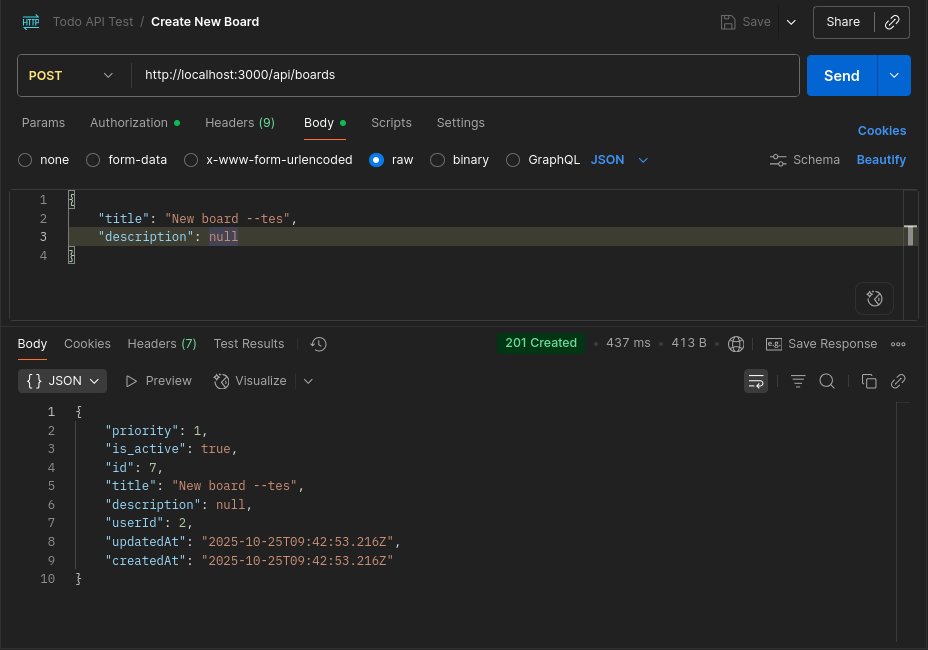

# Todo App API

Sebuah RESTful API sederhana untuk Aplikasi To Do List yang dibuat dengan Express.js

## Beberapa Fitur yang Diimplementasikan

- Autntikasi user dengan token JWT
- Impelementasi ORM (sequalize) untuk manipualasi data
- Manajemen CRUD untuk `board`, `list`, dan `card`'
- User hanya bisa mengakses data yang ia buat sendiri
- Validasi data sebelum disimpan

## Teknologi yang Digunakan

- **Framework:** Express.js
- **Database:** PostgreSQL
- **ORM:** Sequelize
- **Authentication:** JWT (jsonwebtoken)
- **Environment:** dotenv
- **Development:** nodemon, ESLint

## Struktur Proyek

```
src/
├── config/
│   └── database.mjs          # Database configuration
├── controllers/
│   ├── authController.mjs     # Authentication logic
│   ├── boardController.mjs    # Board CRUD operations
│   ├── listController.mjs     # List CRUD operations
│   └── cardController.mjs     # Card CRUD operations
├── middleware/
│   ├── auth.mjs              # JWT authentication middleware
│   ├── logger.mjs            # Request logging
│   ├── validation.mjs        # Request validation
│   └── validators.mjs        # Validation schemas
├── models/
│   ├── index.mjs             # Model associations
│   ├── User.mjs              # User model
│   ├── Board.mjs             # Board model
│   ├── List.mjs              # List model
│   └── Card.mjs              # Card model
├── routes/
│   ├── index.mjs             # Main router
│   ├── auth.mjs              # Authentication routes
│   ├── boards.mjs            # Board routes
│   ├── lists.mjs             # List routes
│   └── cards.mjs             # Card routes
├── index.mjs                 # Application entry point
└── seeder.mjs                # Database seeder
```


## Skema Database

### Users
- `id` (Primary Key)
- `username` (Unique)
- `email` (Unique)
- `password` (Hashed)

### Boards
- `id` (Primary Key)
- `title`
- `description`
- `priority`
- `is_active`
- `userId` (Foreign Key → Users)

### Lists
- `id` (Primary Key)
- `title`
- `position`
- `boardId` (Foreign Key → Boards)

### Cards
- `id` (Primary Key)
- `title`
- `description`
- `position`
- `listId` (Foreign Key → Lists)

## Panduan Instalasi

1. Klon repositori ini
```bash
git clone
cd todo-app
```

2. Instal dependensi
```bash
npm install
```

3. Setup file `.env`
Buat dan sesuaikan file `.env`pada direktori root:
```env
PORT=3000
DB_HOST=localhost
DB_PORT=5432
DB_NAME=todo_app
DB_USER=your_username
DB_PASSWORD=your_password
JWT_SECRET=your_jwt_secret_key
```

4. Setup database
Silahkan buat database pada phpmyadmin atau menggunakan CLI mysql, kemudian bisa lanjut melakukan migrasi atau melakukan seeding data.
```bash
npm run migrate

npm run seed # opsional
```

5. Menjalankan proyek
```bash
npm run dev # untuk pengembangan

npm start # untuk production
```

Setelah itu, server akan berjalan pada `http://localhost:3000`


## Hasil Program

Aplikasi akan berjalan pada `http://localhost:3000`, dan semua endpoints swlain base memerlukan autentikasi token JWT. Berikut daftar endpoint yang tersedia beserta screenshot hasil pengujian menggunakan Postman:

### Autentikasi

**POST /auth/register**
Mendaftarkan user baru dengan validasi email dan password


**POST /auth/register (Validasi)**
Contoh validasi error ketika format email tidak valid


**POST /auth/login**
Login user dan mendapatkan JWT token untuk autentikasi


---

### Boards

**GET /api/boards**
Mengambil semua board milik user yang sedang login


**GET /api/boards/:id**
Mengambil detail board berdasarkan ID tertentu


**GET /api/boards/:id (404)**
Contoh response ketika board tidak ditemukan


**POST /api/boards**
Membuat board baru dengan validasi data


**POST /api/boards (Validasi)**
Contoh validasi error ketika data tidak lengkap


---

### Lists

**GET /api/boards/:boardId/lists**
Mengambil semua list dalam sebuah board


**POST /api/boards/:boardId/lists**
Membuat list baru dalam sebuah board


**PUT /api/lists/:listId**
Mengupdate informasi list yang sudah ada


**DELETE /api/lists/:listId**
Menghapus list beserta semua card di dalamnya


---

### Cards

**POST /api/lists/:listId/cards**
Membuat card baru dalam sebuah list


**PUT /api/cards/:cardId**
Mengupdate informasi card yang sudah ada


**PUT /api/cards/:cardId/move**
Memindahkan card ke list lain atau mengubah posisinya


**DELETE /api/cards/:cardId**
Menghapus card dari list


---

### Route Not Found

**404 Not Found**
Contoh response ketika mengakses endpoint yang tidak tersedia

